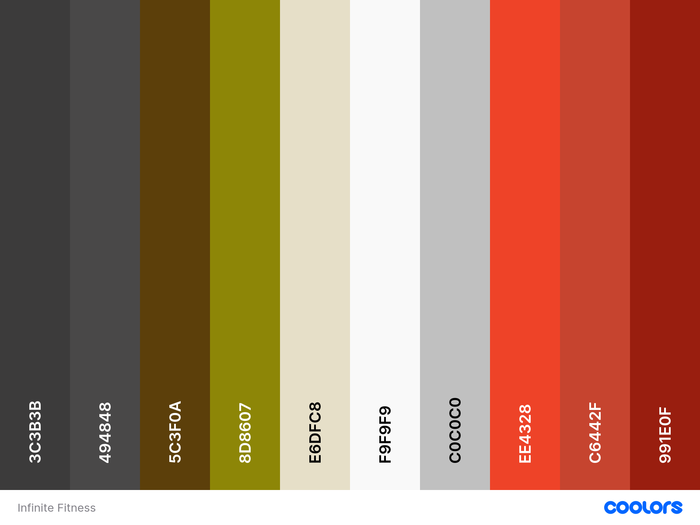

# [Infinite Fitness Website](https://lauren21717.github.io/Infinite_Fitness/)

[](https://github.com/Lauren21717/Infinite_Fitness/commits/main)
[](https://github.com/Lauren21717/Infinite_Fitness/commits/main)
[](https://github.com/Lauren21717/Infinite_Fitness)


source: [amiresponsive](https://ui.dev/amiresponsive?url=https://lauren21717.github.io/Infinite_Fitness/)

**Infinite Fitness: Your Ultimate Fitness Destination**
Infinite Fitness is a modern web platform designed to showcase top-tier fitness services, helping customers find the perfect gym experience. From state-of-the-art facilities to diverse workout classes, nfinite_Fitness highlights everything a gym has to offer, making it easier for potential members to explore and join. With a focus on accessibility and engagement, our platform ensures a seamless experience—allowing users to discover services, book sessions, and stay motivated on their fitness journey.

## User Exprience(UX)

### Colour Scheme

I used [coolors.co](https://coolors.co/3c3b3b-494848-5c3f0a-8d8607-e6dfc8-f9f9f9-c0c0c0-ee4328-c6442f-991e0f) to generate my colour palette.




### Typography

#### Overview
Typography plays a crucial role in enhancing user experience and establishing a strong visual identity for Japan Market. Our font choices have been carefully selected to align with the elegant and high-quality aesthetic of Japanese products, ensuring a cohesive and engaging experience throughout the site.

#### Font Selections

 - [Archivo Black](https://fonts.google.com/specimen/Archivo+Black)\
   Used for headlines and key emphasis points, Archivo Black delivers a bold, energetic, and attention-grabbing presence, perfectly suited for a fitness-focused platform.

 - [Exo 2](https://fonts.google.com/specimen/Exo+2)\
   Selected for body text and general content, Exo 2 combines a futuristic and elegant design, ensuring readability while maintaining a sleek, modern feel.

 - Sans Serif (Fallback Font)\
    In cases where the primary fonts are not available, a generic sans-serif typeface will be used to preserve readability and consistency.

#### Conclusion
By pairing Archivo Black with Exo 2, Infinite Fitness achieves a balance between high-impact visuals and smooth readability. This combination ensures a compelling and motivating user experience, aligning with the platform’s goal of promoting an active lifestyle.

## Project Overview  

Infinite Fitness is a digital platform designed to promote fitness services and attract new members by showcasing the gym’s offerings, including state-of-the-art facilities, diverse workout classes, and specialized training programs. Through an engaging and user-friendly experience, Infinite Fitness aims to connect individuals with the right fitness solutions to help them achieve their goals.  

## Customer Goals  

Infinite Fitness is built to support customers in their fitness journey by addressing key objectives:  

- Improve overall fitness levels.  
- Achieve weight loss and a healthier body composition.  
- Build muscle and increase strength.  
- Enhance flexibility and mobility.  
- Reduce stress through physical activity.  
- Stay motivated and engaged in workout routines.  
- Join group fitness classes for social interaction and added motivation.  

## Business Goals  

Infinite Fitness also serves as a powerful tool for gym owners, helping to:  

- Attract and retain a strong membership base.  
- Improve member retention rates.  
- Enhance brand awareness within the fitness community.  
- Foster a welcoming and safe environment for members to pursue their fitness goals.  

## User Stories  

### New Visitors  

- As a visitor, I want to quickly understand what the gym offers so that I can decide if it meets my fitness needs.  
- As a visitor, I want to explore the gym’s facilities, services, and class offerings so that I can determine if they align with my goals.  
- As a visitor, I want to find clear membership details and pricing so that I can assess the value before committing.  
- As a visitor, I want to see the gym’s location and operating hours so that I can determine if it’s convenient for me.  
- As a visitor, I want an intuitive navigation experience so that I can easily access the information I need.  

### Potential Members  

- As a potential member, I want a simple and user-friendly sign-up process so that I can join the gym with ease.  
- As a potential member, I want to access a class schedule so that I can plan my workouts in advance.  
- As a potential member, I want to see testimonials and success stories so that I feel confident in my decision to join.  
- As a potential member, I want to contact the gym easily so that I can ask any additional questions before signing up.  

### Existing Members  

- As a gym member, I want to book classes online so that I can reserve my spot in advance.  
- As a gym member, I want to access my membership details and benefits so that I stay informed about what’s included.  
- As a gym member, I want to receive fitness tips and updates from the gym so that I stay motivated and engaged.  
- As a gym member, I want to be notified about exclusive promotions and events so that I can take advantage of special offers.  

By structuring Infinite Fitness around these user needs, the platform ensures a seamless and engaging experience for both potential and existing gym members.

## Wireframes

In line with best practices, wireframes were developed for mobile, tablet, and desktop sizes to ensure a consistent and optimized user experience across all devices.

I used [Balsamiq](https://balsamiq.com/wireframes) to create the wireframes for all screen sizes.

### Home Page Wireframes

<details>
<summary>Click here to see the Home Page Wireframes</summary>

  - 

</details>

### About Page Wireframes

<details>
<summary>Click here to see the About Page Wireframes</summary>

  - 

</details>

### Class Page Wireframes

<details>
<summary>Click here to see the Class Page Wireframes</summary>

  - 

</details>

### Join Now Page Wireframes

<details>
<summary>Click here to see the Join Now Page Wireframes</summary>

  - 

</details>

## Features

### Existing Features

- **Nav Bar**
    - The gym's name, linking to the home page.
    
  
    - Offer navigation links and the site's title for the Home, About, Classes, and Join Now pages.
    
  
    - Activate the Home to indicate the current page the user is viewing.
    
  
    - Display the menu icon on tablet and mobile devices.
    

- **Footer**
    - The "About Us" text is displayed in the footer.
    
  
    - Provide navigation links and the site's title for the Home, About, Classes, and Join Now pages.
    
  
    - Includes links to social media platforms.
    

- **Home**
    - The callout section displays an introduction and promotion text, accompanied by a button linking to the "Join Now" page.
    
  
    - Highlight the advantages and characteristics of our gym.
    
  
    - Motivational carousel images.
    
  
    - Embeds a map to showcase the gym's location.
    
  
    - Member photos and reviews.
    

- **About**
    - Activate the About to indicate the current page the user is viewing.
    
  
    - Includes details about the gym.
    
  
    - Showcases our facilities.
    

- **Class**
    - Activate the Class to indicate the current page the user is viewing.
    
  
    - Description of gym classes.
    
  
    - Display schedules for Cardio, Group Training, Yoga, and Equipment.
    
  
    - Highlights the benefits of our three membership tiers.
    

- **Join Now**
    - Activate the Join Now to indicate the current page the user is viewing.
    
  
    - Includes a form for users to enter their name, email, phone number, gender, and message. Users can register for the free trial and leave a message.
    
  
    - The submit button links to the confirmation page, where users can view confirmation texts.
    

## Tools and Technologies Used

- **Design & Wireframing:**
  - [](https://balsamiq.com/wireframes) - For creating initial wireframes.
  - [](https://www.figma.com/) - For designing UI and refining wireframes.
  - [](https://www.canva.com/p/canvawireframes) - Additional wireframe and visual design support.

- **Version Control & Collaboration:**
  - [](https://git-scm.com) - For tracking code changes.
  - [](https://github.com) - Code repository for collaboration and hosting.
  - [](https://gitpod.io) - Cloud-based IDE for streamlined development.

- **Frameworks, Libraries & Programs Used:**
  - [](https://getbootstrap.com/docs/5.1/getting-started/introduction/) - For responsive design and styling.
  - [](https://fonts.google.com/) - For font styling and consistency across pages.
  - [](https://copilot.microsoft.com/images/create) - For generating images using AI based on words.
  - [](https://fontawesome.com/v5/search) - For icons used across the website to enhance design and UX.

## Testing

> [!NOTE]  
> For all testing, please refer to the [TESTING.md](TESTING.md) file.

## Deployment

The site was deployed to GitHub Pages. The steps to deploy are as follows:

- In the [GitHub repository](https://github.com/Lauren21717/Infinite_Fitness), navigate to the **Settings** tab.
- From the source section drop-down menu, select the **Main** branch, then click "Save".
- The page will automatically refresh with a detailed ribbon display to indicate the successful deployment.

The live link can be found [here](https://lauren21717.github.io/Infinite_Fitness/)

### Local Deployment

This project can be cloned or forked in order to make a local copy on your own system.

#### Cloning

1. Go to the GitHub repository.
2. Click on the "Code" button and copy the URL.
3. Open your terminal and run:
   ```bash
   git clone https://github.com/Lauren21717/Infinite_Fitness

#### Forking

By forking a GitHub repository, you create a personal copy of the original repository under your own GitHub account. This allows you to view and modify the code without affecting the original repository.

To fork this repository, follow these steps:

1. Log in to GitHub and navigate to the [GitHub Repository](https://github.com/Lauren21717/Infinite_Fitness).
2. At the top-right corner of the repository page, just above the "Settings" button, click the "Fork" button.
3. After clicking the "Fork" button, a copy of the repository will be created under your GitHub account.

You can now work on your own copy of the repository, make changes, and propose improvements through pull requests if desired.

## Credits

- [Bootstrap](https://getbootstrap.com/docs/5.3/components/navbar/) - Code for the off-canvas navigation bar.
- [Bootstrap](https://getbootstrap.com/docs/5.3/components/carousel/#autoplaying-carousels) - Autoplaying carousel code.
- [CSS-Tricks](https://css-tricks.com/perfect-full-page-background-image/) - Full-size background code.
- [Code Institute](https://codeinstitute.net/full-stack-software-development-diploma/) - Callout and button code, with modifications for the project.
- [ChatGPT](https://chat.openai.com/) - Content generation assistance.
- [Font Awesome](https://fontawesome.com/) - Icons used throughout the website.
- [Google](https://images.google.com) - Images for media and content across the site.