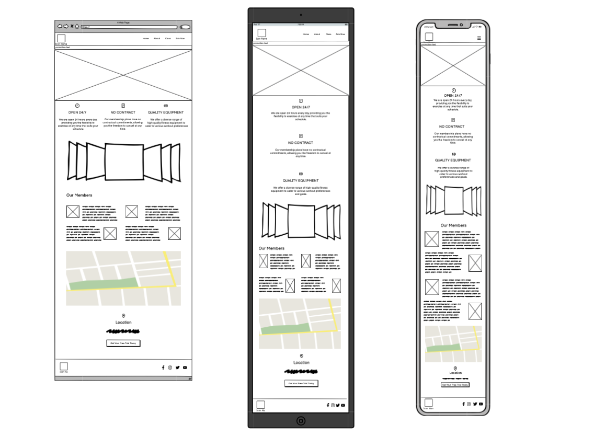

# Infinite Fitness Website

## Table of contents

## User Exprience(UX)

- ### Goals

  - #### Project goal 
    - The project goal is promote fitness services to the customer, we will showcase the gym's services, facilities, and classes to attract new members.
  
  
  - #### Customer goal:
     1. Improve fitness levels.
     2. Weight loss and achieve a healthier body composition.
     3. To build muscle and increase strength.
     4. Improve flexibility and mobility.
     5. Stress relieve.
     6. To maintain interest and motivation in the workout routine.
     7. Join a group fitness classes for motivation and social interaction.
  
  - #### Business  goal:
     1. To draw in and maintain a substantial membership base.
     2. Enhance member retention rate.
     3. Improve the awareness of your band.
     4. To create a warm and secure atmosphere where members can pursue their fitness objectives.
  
- ### User stories
    ||User Story|Acceptance Criteria|
    | ----- | ----- | ----- |
    |1.| I seek information about the gym's services and facilities.| I can easily find a section detailing all services and facilities offered by the gym.|
    |2.| I am interested in obtaining membership details, such as membership welfare and special offers.| On the membership section of the website, I am able to view membership details and any available special offers.|
    |3.| I need to know the gym's location to decide whether to join.| The gym's location be prominently displayed on the home page of the website, easily accessible for visitors to make an informed decision about joining.|
    |4.| I want an easy navigation experience throughout the site to find relevant content.| When navigating through the website, I find it intuitive and straightforward to locate relevant content.|
    |5.| I want a straightforward process to sign up for the gym.| On the website, it shows clear and user-friendly process for signing up for the gym, with a user friendly form.|
    |6.| I need access to the schedule of classes for planning my workouts.| I discovered a clear schedule outlining all classes, including their descriptions and respective timings.|

- ### Design

  - #### Fonts
     - I've chosen Archivo Black for the headlines because of its energetic and eye-catching appearance. For the overall page, I'll be using Exo 2, which imparts a futuristic feel while maintaining an elegant design. Sans Serif will serve as the fallback font in case, for any reason, the intended fonts aren't imported into the site correctly.

   - #### Colour
     - The predominant colors I'll employ on the website are red and white, symbolizing enthusiasm and passion.

   - #### Photo
     - I have placed photos on each page, as well as a photo gallery on the homepage, to make it visually appealing and motivational.

- ### Wireframe
    - Home Page Wireframe 
    
    - About Page Wireframe 
    
    - Class Page Wireframe 
    
    - Join Now Page Wireframe 
    

- ## Features
  - ### Nav Bar
    |||
    |-|-|
    |The gym's name, linking to the home page.||
    |Offer navigation links and the site's title for the Home, About, Classes, and Join Now pages.||
    |Activate the Home to indicate the current page the user is viewing.||
    |Display the menu icon on tablet and mobile devices.||

  - ### Footer
    |||
    |-|-|
    |The "About Us" text is displayed in the footer.||
    |Provide navigation links and the site's title for the Home, About, Classes, and Join Now pages.||
    |Includes links to social media platforms.||
    
  - ### Home
    |||
    |-|-|
    |The callout section displays an introduction and promotion text, accompanied by a button linking to the "Join Now" page.||
    |Highlight the advantages and characteristics of our gym.||
    |Motivational carousel images.||
    |Embeds a map to showcase the gym's location.||
    |Member photos and reviews.||

  - ### About
    |||
    |-|-|
    |Activate the About to indicate the current page the user is viewing.||
    |Includes details about the gym.||
    |Showcases our facilities.||

  - ### Class
    |||
    |-|-|
    |Activate the Class to indicate the current page the user is viewing.||
    |Description of gym classes.||
    |Display schedules for Cardio, Group Training, Yoga, and Equipment.||
    |Highlights the benefits of our three membership tiers.||
    

  - ### Join Now
    |||
    |-|-|
    |Activate the Join Now to indicate the current page the user is viewing.||
    |Includes a form for users to enter their name, email, phone number, gender, and message. Users can register for the free trial and leave a message.||
    |The submit button links to the confirmation page, where users can view confirmation texts.||
    
- ## Technologies Used

- ### Languages Used
    - HTML5
    - CSS3

- ### Frameworks, Libraries & Programs Used
    1. [Balsamiq](https://balsamiq.com/)
        - Wireframes for the design process were crafted using Balsamiq.
    2. [GitHub](https://github.com/)
        - The project code is stored on GitHub after being pushed from Git.
    3. [Git](https://git-scm.com/)
        - The version control for the project was managed using Git, with Gitpod terminal being utilized for commits to Git and pushes to GitHub.
    4. [Bootstrap 5.1](https://getbootstrap.com/docs/5.1/getting-started/introduction/)
        - Bootstrap played a role in facilitating the responsiveness and styling of the website.
    5. [Google Fonts](https://fonts.google.com/)
        - Google Fonts were utilized to import the font into the style.css file, ensuring consistency across all pages throughout the project.
    6. [Image Creator from Microsoft Designer](https://copilot.microsoft.com/images/create)
       - Image Creator from Designer helps you generate images based on your words with AI.
    7. [Font Awesome](https://fontawesome.com/v5/search)
       - Font Awesome icons were incorporated on all pages across the website to enhance aesthetics and improve the UX.

- ## Testing

- ### Validator Testing
    - #### HTML
        - [W3C Validator - index.html]()
          
        - [W3C Validator - about.html]()
          
        - [W3C Validator - class.html]()
          
        - [W3C Validator - join.html]()
          
        - [W3C Validator - confirmation.html]()
          
    - #### CSS
        - [Jigsaw Validator - CSS]()
          

- ### Google Developer Tools Lighthouse
    - #### Home
      
    - #### About
      
    - #### Class
      
    - #### Join Now
      

- ### Responsiveness
    - Screenshots of responsive design breakpoints for various devices.
    - Viewport - Desktop: # / Laptop: # / Tablet: # / Mobile: #.
 
      
      
      
      

- ## Manual Testing
    - Manual testing conducted on the page include:
        - #### Navigation Testing
            - Ensure all navigation links and menus function correctly and navigate to the intended page.
        - #### Form Testing
            - Test the forms to ensure they submit data correctly and display appropriate validation messages for any errors.
        - #### Content Testing
            - Review all text content, images, and multimedia elements to ensure accuracy, relevance, and proper formatting.
        - #### Functionality Testing
            - Test all interactive elements such as buttons, dropdowns, sliders, and accordions to ensure they perform their intended functions without errors.
        - #### Cross-Browser Testing
            - Verify the compatibility of the website across different web browsers (e.g., Chrome, Firefox, Safari) to ensure consistent behavior and appearance.
        - #### Compatibility Testing
            -Test the website on different devices (e.g., desktops, laptops, tablets, smartphones) and operating systems (e.g., Windows, macOS, iOS, Android) to ensure compatibility and functionality across various platforms.
- ### 

- ### Bugs Discovered
    -  I checked the code by [HTML Validator](https://validator.w3.org/) and fixed some warning and error.
       - #### index.html
           1. Fixed Warning: Section lacks heading
              - Resolved the warning by replacing the <section> tag with a 
 tag for the container without a heading.
              - From: `<section class="container-fluid navalert-container">`
                To: `
`
           2. Section lacks heading
              - Fixed the warning by replacing the <section> tag with a 
 tag for the container without a heading.
              - From: `<section class="container-fluid callout-container">`
                To: `
`
           3. Stray end tag `
`
              - Deleted the `
` in line 79 to fix the error.
           4. Section lacks heading
              - Fixed the warning by replacing the `<section>` tag with a `
` tag for the container without a heading.
              - From: `<section class="carousel-container">`
                To: `
`
     - #### about.html
          1. Warning - Section lacks heading
              - Addressed the warning by replacing `<section class="about-header">` with `
`.
              - From: `<section class="about-header">`
                To: `
`
          2. Stray end tag `
`
              - Removed the stray `
` tag at line 124 to resolve the error
          3. Stray end tag `
`
              - Deleted the unnecessary `
` tag at line 127 to fix the error.
    - #### class.html
         1. Warning - Section lacks heading
              - Corrected the warning by changing `<section class="about-header">` to `
`.
              - From: `<section class="about-header">`
                To: `
`
         2. Error - Stray end tag `</section>`
              - Removed the unnecessary `</section>` tag at line 137 to resolve the error.
    - #### join.html
         1. Error - Missing DOCTYPE
              - Rectified the error by adding `<!DOCTYPE html>` at the beginning of the document.
              - Before: `<html lang="en">`
                After: `<!DOCTYPE html>`
                        `<html lang="en">`
          2. Warning - Section lacks heading
              - Corrected the warning by changing `<section class="join-us-header">` to `
`.
              - From: `<section class="join-us-header">`
                To: `
`
          3. Error - Stray end tag `</label>`
              - Resolved the error by removing the unnecessary `</label>` tag at line 112.
    - #### confirmation.html
         1. Error - Missing DOCTYPE
              - Rectified the error by adding `<!DOCTYPE html>` at the beginning of the document.
              - Before: `<html lang="en">`
                After: `<!DOCTYPE html>`
                        `<html lang="en">`
          2. Warning - Section lacks heading
              - CCorrected the warning by changing `<section class="confirmation-header">` to `
`.
              - From: `<section class="confirmation-header">`
                To: `
`
    - #### CSS
       - I use the CSS Validator and I founds no error and bugs.           

- ## UI Improvements
  - Adjust the `border-radius` of the `pic` on the about, class, and join now pages to maintain consistency and enhance the user experience.
    
      - ### About
        |Before|After|
        |---|---|
        |||
      - ### Class
        |Before|After|
        |---|---|
        |||
      - ### Join Now
        |Before|After|
        |---|---|
        |||

- ## Credit
    - ###  Code
        - I implemented the off-canvas navigation bar code from [Bootstrap](http://getbootstrap.com/docs/5.3/components/navbar/)
        - [Bootstrap autoplaying carousels](https://getbootstrap.com/docs/5.3/components/carousel/#autoplaying-carousels) for the carousel slider.
        - [CSS-TRICKS](https://css-tricks.com/perfect-full-page-background-image/) for full size background.
        - The callout code is from the lesson titled "Updating the Callout" on [Code Institute's](https://codeinstitute.net/full-stack-software-development-diploma/?utm_term=code%20institute&utm_campaign=CI+-+UK+-+Search+-+Brand&utm_source=adwords&utm_medium=ppc&hsa_acc=8983321581&hsa_cam=1578649861&hsa_grp=62188641240&hsa_ad=635720257674&hsa_src=g&hsa_tgt=kwd-319867646331&hsa_kw=code%20institute&hsa_mt=e&hsa_net=adwords&hsa_ver=3&gad_source=1&gbraid=0AAAAADnKut8X7dWnPjX2BFo_L9i_jjhPu&gclid=CjwKCAiA29auBhBxEiwAnKcSqux1aKPppa2HXA2CJkkSAp244QIqf9QPYGK24XywOxpaX1ZpQLKPRRoCuqEQAvD_BwE) Bootstrap course.
        - The button code has been sourced from the Bootstrap lesson titled "Updating the Callout" on [Code Institute's](https://codeinstitute.net/full-stack-software-development-diploma/?utm_term=code%20institute&utm_campaign=CI+-+UK+-+Search+-+Brand&utm_source=adwords&utm_medium=ppc&hsa_acc=8983321581&hsa_cam=1578649861&hsa_grp=62188641240&hsa_ad=635720257674&hsa_src=g&hsa_tgt=kwd-319867646331&hsa_kw=code%20institute&hsa_mt=e&hsa_net=adwords&hsa_ver=3&gad_source=1&gbraid=0AAAAADnKut8X7dWnPjX2BFo_L9i_jjhPu&gclid=CjwKCAiA29auBhBxEiwAnKcSqux1aKPppa2HXA2CJkkSAp244QIqf9QPYGK24XywOxpaX1ZpQLKPRRoCuqEQAvD_BwE) course, with slight modifications to suit the project requirements.
    - ### Content
        -The content has been generated using [ChatGPT 3.5](https://chat.openai.com/).
    - ### Media
        
- ## Deployment

- ### How to run this project locally
